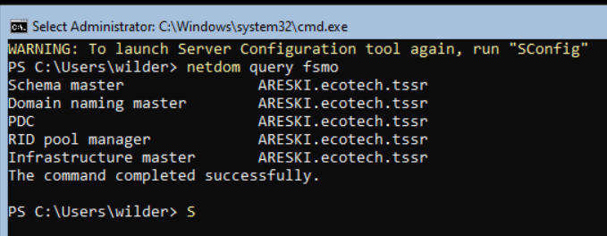
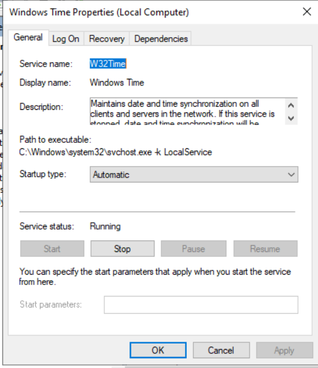
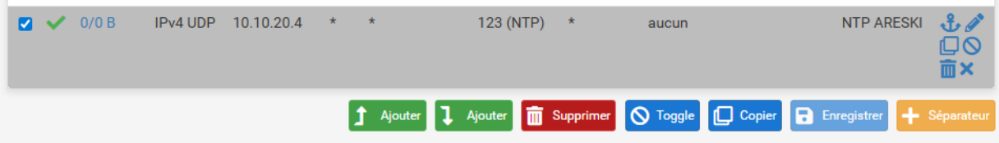
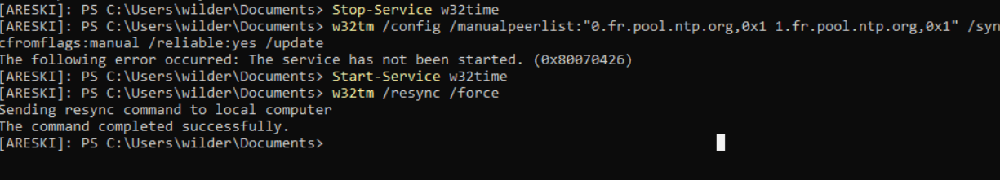

Areski est notre Maitre FSMO du domaine
c'est tout naturellement qu'il détient aussi le pouvoir du temps et qu'il va le distribuer.







pour NTP on est sur le port 123 en udp 

# 1. Arrêter le service de temps
```
Stop-Service w32time
```

# 2. Configurer les sources externes (ex: serveurs français du pool NTP) 


**Le flag 0x1 indique un intervalle de synchronisation régulier**


```
w32tm /config /manualpeerlist:"0.fr.pool.ntp.org,0x1 1.fr.pool.ntp.org,0x1" /syncfromflags:manual /reliable:yes /update

```
# 3. Redémarrer le service
```
Start-Service w32time
```

# 4. Forcer la synchronisation immédiate
```
w32tm /resync /force
```




Quelle heure est il ?


ARESKI interroge un **pool de serveurs via un mécanisme de rotation DNS (Round Robin)** pour obtenir une adresse **Unicast** de strate supérieure."
Cette valeur de **13 ms** (millisecondes) représente le **Round Trip Time (RTT)**, c'est-à-dire le temps de trajet aller-retour de vos paquets de données entre votre serveur **ARESKI** et le serveur de temps sur Internet.

### Analyse technique de ce délai

En informatique de réseau, et particulièrement pour le protocole NTP, une latence de 13 ms est considérée comme **excellente**.

- **Précision du temps** : Le protocole NTP utilise cet "Offset" (décalage) pour calculer le délai de propagation réseau. Plus la latence est faible et stable (faible gigue), plus la synchronisation de l'horloge de votre contrôleur de domaine sera précise.
    
- **Localisation** : Un délai de 13 ms confirme que vous communiquez avec un serveur physiquement proche (probablement en France ou en Europe limitrophe), ce qui valide l'efficacité du pool `0.fr.pool.ntp.org`.
    

### Comparaison des échelles de latence

|Latence|Qualité pour NTP|Impact sur Active Directory|
|---|---|---|
|**< 20 ms**|**Optimale**|Synchronisation quasi parfaite (microsecondes).|
|**20 - 100 ms**|**Standard**|Fonctionnement normal, aucun impact visible.|
|**> 500 ms**|**Critique**|Risque de dérive temporelle ou d'échec de synchro.|

Exporter vers Sheets

---

### Problème potentiel : La "Gigue" (Jitter)

La latence de 13 ms est bonne, mais le plus important est qu'elle reste **constante**. Si vous voyez ce chiffre sauter de 13 ms à 200 ms de manière erratique, NTP aura du mal à stabiliser l'horloge.

Pour surveiller la précision actuelle de votre horloge par rapport à la source, vous pouvez taper :

PowerShell

```
w32tm /query /status
```

Regardez la valeur **Precision**. Elle devrait être autour de `-23` (ce qui correspond à environ 1 microseconde de précision interne).


Le chiffre `-23` que vous obtenez est une valeur logarithmique ($2^{-23}$ secondes). Traduit en clair, cela signifie que l'horloge système de votre serveur **ARESKI** est capable de mesurer le temps avec une finesse de **119 nanosecondes**.

### Pourquoi cette valeur est-elle idéale ?

* **Stabilité matérielle** : Cela indique que le cristal de quartz (l'horloge matérielle) de votre carte mère (ou de votre hyperviseur) est de bonne qualité et que le noyau Windows arrive à le cadencer très précisément.
* **Performance Kerberos** : Pour Active Directory, une dérive de quelques millisecondes est tolérée, mais travailler à l'échelle de la nanoseconde garantit qu'il n'y aura jamais de conflit de jetons d'authentification ou de problèmes de réplication de base de données.


---

### Vérification de la "Discipline" du temps
Maintenant que la précision interne est validée, regardez la ligne **"Root Dispersion"** dans votre commande status :
* Elle représente l'erreur maximale accumulée entre votre serveur et la source de strate 1 (l'horloge atomique).
* Si elle est inférieure à **0.1s**, votre serveur est considéré comme une source de temps "Saine" pour tout le reste du domaine.

### Quelle est la suite pour ARESKI ?
Votre socle de base (DNS, AD DS, NTP via pfSense) est désormais **parfaitement configuré**.

Comme vous avez déjà installé le rôle **NPS (RADIUS)**, la prochaine étape logique est de préparer l'authentification. 
**Souhaitez-vous que je vous aide à créer le "Shared Secret" (Secret partagé) et à configurer votre premier client RADIUS en ligne de commande ?**
