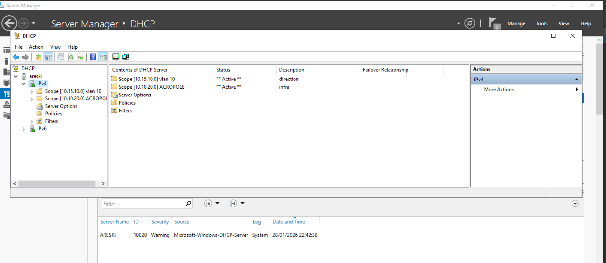

### Scopes configurés sur ARESKI

| Scope | Réseau | Plage | Durée bail |
|-------|--------|-------|------------|
| ACROPOLE | 10.10.20.0/26 | 10.10.20.1 - 10.10.20.60 | 8 jours |
| VLAN 10 | 10.15.10.0/24 | 10.15.10.1 - 10.15.10.254 | 8 jours |

### Vérification
```powershell
Get-DhcpServerv4Scope
Get-DhcpServerv4Statistics
```
