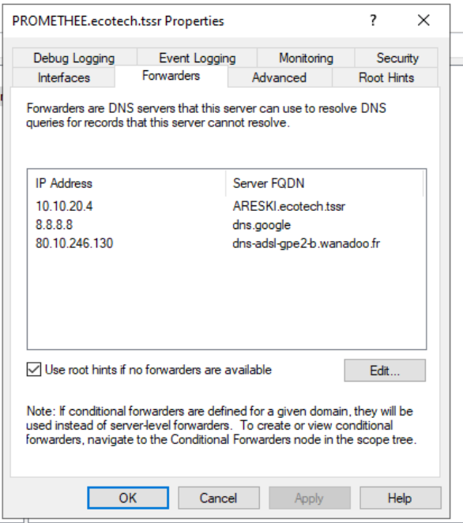

### Configuration sur ARESKI
- Zone directe : **ecotech.tssr**
- DNS Forwarders configurés
- Enregistrements A pour l'infrastructure

### Enregistrements principaux
- areski.ecotech.tssr → 10.10.20.4
- promethee.ecotech.tssr → (IP de PROMETHEE)
- mail.ecotech.tssr → (IP serveur mail - à créer)

### Vérification
```powershell
# Résoudre le domaine
Resolve-DnsName ecotech.tssr

# Vérifier le SRV LDAP
Resolve-DnsName -Type SRV _ldap._tcp.dc._msdcs.ecotech.tssr
```

---
