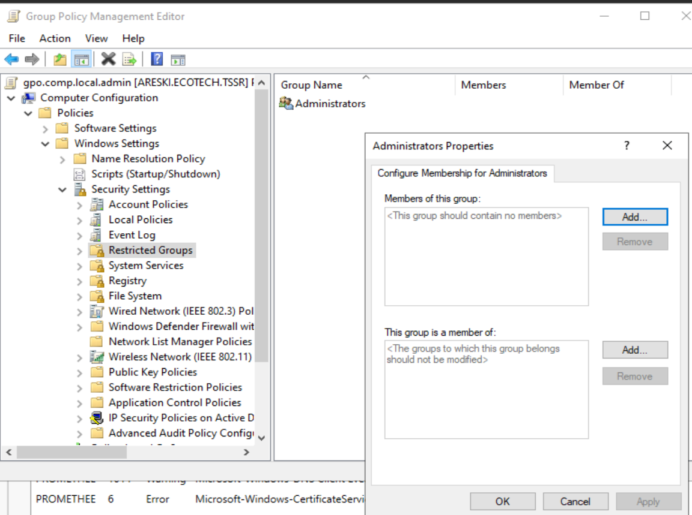
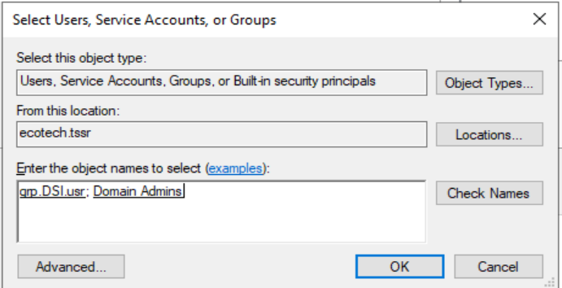
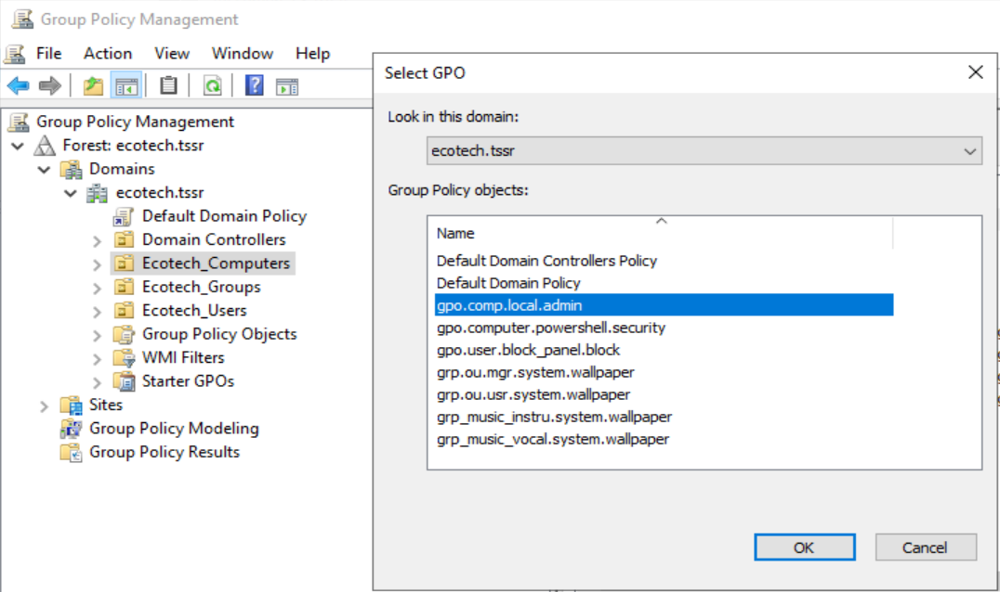

**La GPO `gpo.computer.local.admin` fait une seule chose :**

Elle dit à **toutes les machines du domaine** : _"ton groupe Administrators local doit contenir exactement ces membres"_.
**Sans cette GPO :**
Chaque machine a son propre groupe Administrators local, géré indépendamment. Si tu veux qu'un technicien DSI puisse administrer 100 machines, tu dois l'ajouter manuellement sur les 100 machines.
**Avec cette GPO :**
Tu définis une fois pour toutes, de façon centralisée :

```
Administrators local de chaque machine =
├── APOLLON\Administrateur  (compte local d'urgence)
├── ecotech\Domain Admins   (admins du domaine)
└── ecotech\grp.DSI.usr     (techniciens DSI)
```

Dès qu'une nouvelle machine rejoint le domaine et reçoit la GPO, les techniciens DSI sont **automatiquement** admins locaux dessus, sans intervention manuelle.
**Résumé en une phrase :**
Cette GPO permet de gérer les droits d'administration locale de toutes les machines **depuis un seul endroit** (le DC), plutôt que machine par machine.