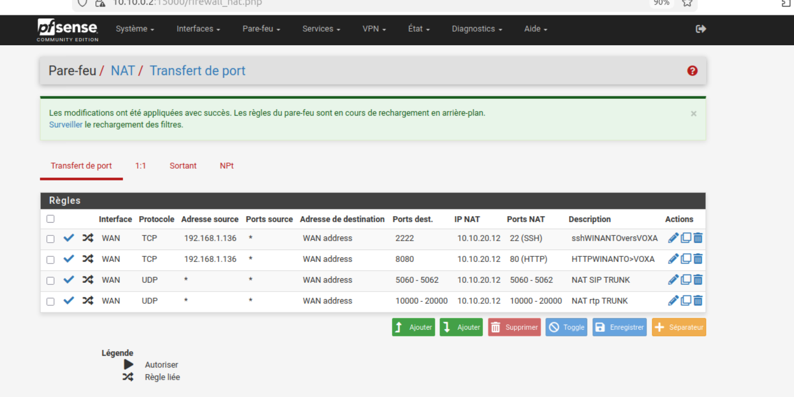

Depuis le début du projet , la connexion ssh est utile car elle permet de configurer les vms a partir de mon host Windows 1O
j'ai donc sur chaque Vm monter une interface en nat dans Virtual box avec une redirection de port .
Chaque vm à son port attribué et donc le ssh se fait a volo.
Dans une infrastructure "un peu" plus réaliste les interfaces sont uniques sur le réseau attribué , du coup les connexions ssh ou http ( interface graphique d'un service ) les flux donc,  doivent être contrôlées et filtrés .
par exemple , pour que mon host puisse  configurer en commande et en graphique le service de Freepbx avec asterisk il me faut deux connexions:  
 - une en ssh vers VOXA sur le réseau Acropole  depuis mon Host sur le réseau public de ma box donc en passant par le pare feu HEPHAISTOS et le routeur ATHENA.
- de même pour le service de contrôle de l'interface graphique en http.
 on va donc faire une redirection de port  en 2222 pour le ssh et en 8080 pour http .
 Pfsense dirigera les paquets vers VOXA et en fonction du port recu proposera le service ...

de tel manière il est possible de gerer les serveurs de son infra depuis son host tout en restant proteger par le pare feu 
peti a petit je vais éteindre toute les interfaces en NAT et Bridge et creer les regles de nat corespondantes .
 exemple 
 connexion sur VOXA en ssh 
 grace a la redirection de port sur pfsense 
```
  ssh -p 2222 wilder@192.168.1.250
  wilder@192.168.1.250's password:
  on arrive sur VOXA 
  on se connecte en root 
  [wilder@VOXA ~]$ su
   Mot de passe :
   on est connecté en root sur FreePbx 
```