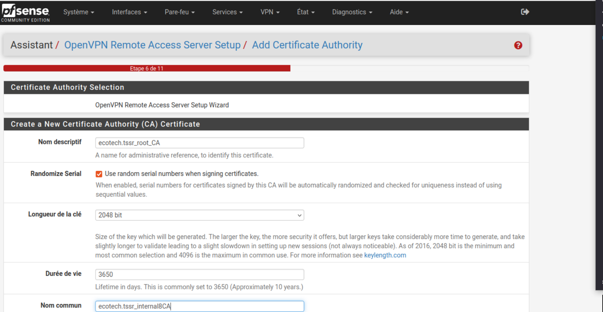
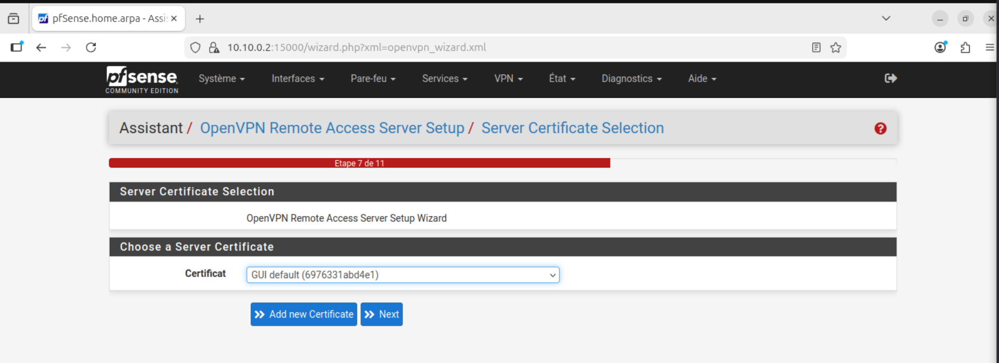
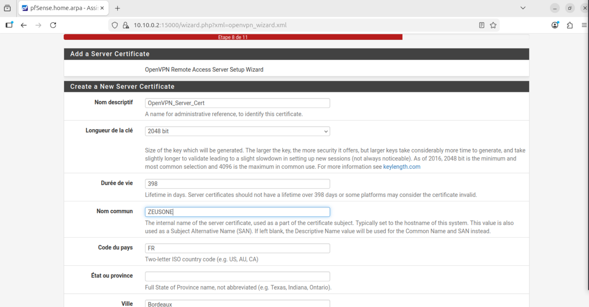
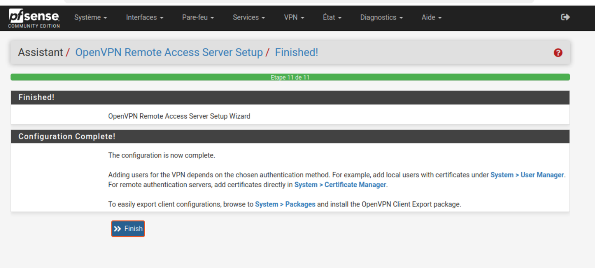
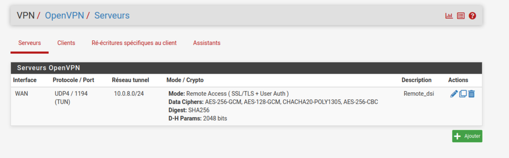
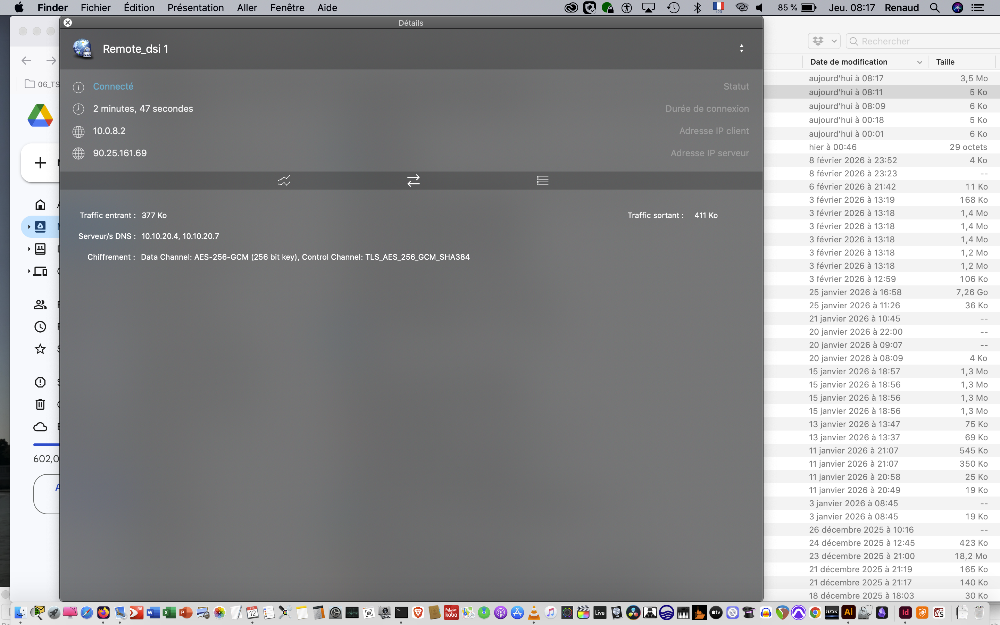
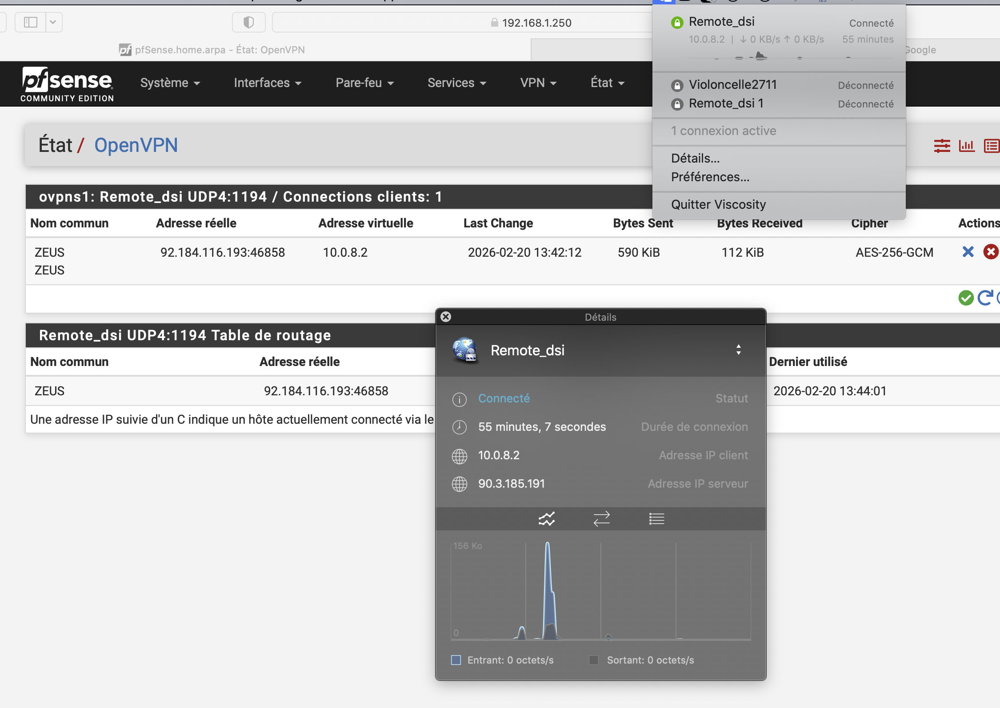

Dans le cadre de la rénovation de l'infrastructure réseau de la société Ecotech la mise en place d'une liaison VPN pour pouvoir gérer les services en dehors du réseau interne.
Ce VPN se met en place avec la configuration du pare feu Pfsence et nécessite la création de certificat , la connaissance de votre ip public et la possibilité de configurer votre FAI en NAT.

