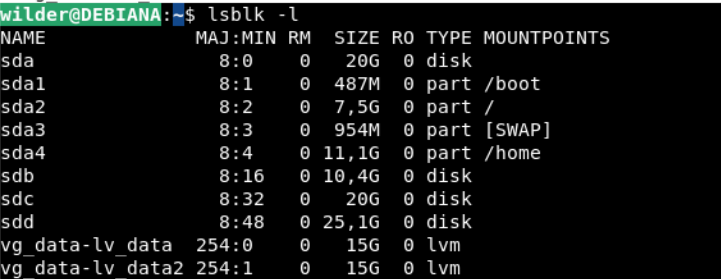
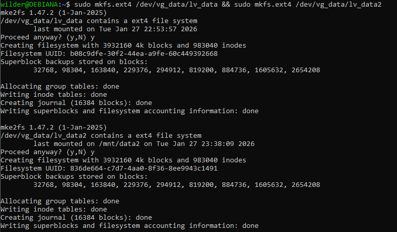
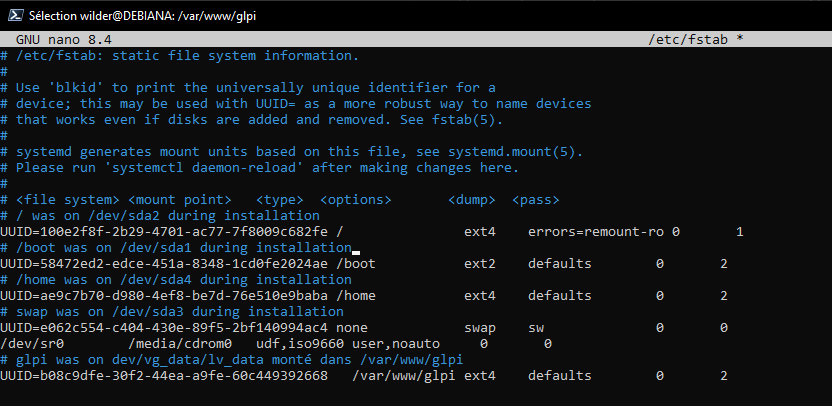
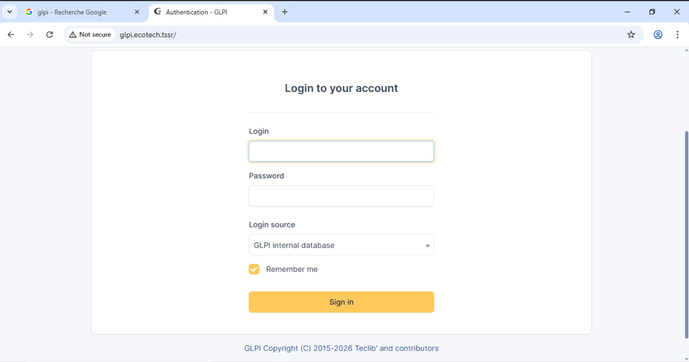
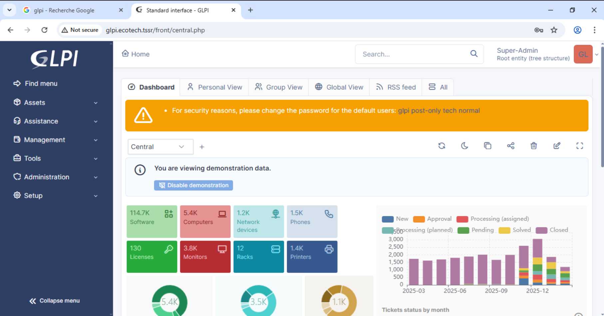

Installation de GLPI sur une debian 13 gui
commande faite depuis host en ssh sur port 34000 
Deux cartes reseau sur virtual box 
1 en nat avec redirection de port 
1 en reseau interen sur reseau ACROPOLE  avec ip fixe en 10.10.20.10

installation de glpi sur lvdata ( on installera iredmail sur lv data 2)




 Creation du point de montage dans un dossier "glpi" dans /var/www/  repertoire standart pour les serveurs web :
```
 sudo mkdir -p /var/www/glpi
```
 
puis
```
wilder@DEBIANA:/var/www$ ls

glpi

wilder@DEBIANA:/var/www$ sudo mount /dev/vg_data/lv_data /var/www/glpi 
```
On monte donc la partition dans glpi et on recupere l'ID pour fixer le montage dans le fichier fstab

```
wilder@DEBIANA:/var/www/glpi$ sudo blkid /dev/vg_data/lv_data

/dev/vg_data/lv_data: UUID="b08c9dfe-30f2-44ea-a9fe-60c449392668" BLOCK_SIZE="4096" TYPE="ext4"

```


fichier fstab :
on verifie et on force tous les disques a monter ( -a pour all )

```
wilder@DEBIANA:/var/www/glpi$ sudo mount -a && df -h /var/www/glpi
Sys. de fichiers            Taille Utilisé Dispo Uti% Monté sur
/dev/mapper/vg_data-lv_data    15G    2,1M   14G   1% /var/www/glpi
```


maintenant :

## Installation de LAMP (APACHE2 Mariadb PHP)


```
sudo apt update && sudo apt upgrade -y

sudo apt install apache2 mariadb-server php php-mysql php-xml php-curl php-gd php-intl php-ldap php-zip php-mbstring php-bz2 -y

```

on secure mariadb comme dans la quete

```
wilder@DEBIANA:~$ sudo mariadb -e "ALTER USER 'root'@'localhost' IDENTIFIED BY 'Azerty1*';"
```

```
wilder@DEBIANA:~$ sudo mariadb -u root -pAzerty1* -e "DELETE FROM mysql.user WHERE User='';"
```
```

```


```
sudo mariadb -u root -pAzerty1* -e "DELETE FROM mysql.user WHERE User='';"
sudo mariadb -u root -pAzerty1* -e "DROP DATABASE IF EXISTS test;"
sudo mariadb -u root -pAzerty1* -e "DELETE FROM mysql.db WHERE Db='test' OR Db='test\\%';"
sudo mariadb -u root -pAzerty1* -e "DELETE FROM mysql.user WHERE User='root' AND Host NOT IN ('localhost','127.0.0.1','::1');"
sudo mariadb -u root -pAzerty1* -e "FLUSH PRIVILEGES;"
```

creation de la bdd "glpi" sur mariadb 

On crée maintenant la base de données et l'utilisateur dédié GLPI :


```
sudo mariadb -u root -pAzerty1* -e "CREATE DATABASE glpi CHARACTER SET utf8mb4 COLLATE utf8mb4_unicode_ci;"
```

### **explication ** :  


- `-u` = user
- `-p` = password, **sans espace** entre `-p` et le mot de passe

- **CHARACTER SET utf8mb4** : encodage Unicode complet, supporte tous les caractères y compris les emojis (utf8 classique est limité à 3 octets, utf8mb4 va jusqu'à 4 octets)
- **COLLATE utf8mb4_unicode_ci** : règles de tri et comparaison des chaînes, `ci` = case insensitive (pas de différence majuscules/minuscules dans les recherches)

creation de l'utilisateur 'glpi'

```
sudo mariadb -u root -pAzerty1* -e "CREATE USER 'glpi'@'localhost' IDENTIFIED BY 'Azerty1*';"
```

et on lui colle tous les droits 

```
sudo mariadb -u root -pAzerty1* -e "GRANT ALL PRIVILEGES ON glpi.* TO 'glpi'@'localhost';"
```

```
sudo mariadb -u root -pAzerty1* -e "FLUSH PRIVILEGES;"

```


Elle recharge la table des privilèges MariaDB en mémoire. Sans ça, les droits accordés avec `GRANT` ne sont pas pris en compte immédiatement.

comment savoir et comprendre ca tout seul . quel logique faut il avoir

La logique à avoir :

**1. Comprendre que MariaDB charge ses configs en RAM au démarrage** Quand tu modifies des privilèges, tu modifies des tables SQL (`mysql.user`, `mysql.db`). MariaDB a déjà chargé ces tables en mémoire → il ne relit pas automatiquement ce que tu viens d'écrire. `FLUSH PRIVILEGES` force cette relecture.

**2. La règle générale en informatique** Quand tu modifies une config d'un service en cours de fonctionnement, il faut soit :

- Redémarrer le service (`systemctl restart mariadb`)
- Ou lui dire de relire sa config sans redémarrer (`FLUSH PRIVILEGES`)

**3. Comment apprendre seul**

- La doc officielle MariaDB est excellente : `mariadb.com/kb`
- Quand tu ne comprends pas une commande → `man <commande>` ou `<commande> --help`
- Chercher le **pourquoi** avant le **comment**
- Reproduire les erreurs volontairement pour comprendre ce qui se passe

**4. La vraie logique TSSR** Tout service a un cycle : **config → rechargement → vérification**. Si tu intègres ce réflexe, tu n'as plus besoin de mémoriser chaque commande.

MariaDB a une base système appelée `mysql` qui contient plusieurs tables de gestion interne. Les principales :

**`mysql.user`** Table centrale des comptes. Contient : nom d'utilisateur, hôte autorisé, mot de passe hashé, et les privilèges globaux (SUPER, CREATE, DROP...).

**`mysql.db`** Privilèges par base de données. Quand tu fais `GRANT ... ON glpi.*`, c'est ici que ça s'écrit.

**`mysql.tables_priv`** Privilèges au niveau table (plus fin que par base).

**`mysql.columns_priv`** Privilèges au niveau colonne (très granulaire, rarement utilisé).

**`mysql.host`** Restrictions par hôte (obsolète depuis MariaDB 10.x, fusionné dans `mysql.user`).

---

**La logique globale :**

```
mysql.user      → QUI peut se connecter et DEPUIS OÙ
mysql.db        → SUR QUELLE BASE il a des droits
mysql.tables_priv → SUR QUELLE TABLE
mysql.columns_priv → SUR QUELLE COLONNE
```

C'est une hiérarchie du plus global au plus précis. MariaDB vérifie dans cet ordre à chaque connexion

telechragement de 

wget https://github.com/glpi-project/glpi/releases/download/10.0.17/glpi-10.0.17.tgz

On extrait l'archive dans `/var/www/glpi` :

bash

```bash
sudo tar -xzf glpi-10.0.17.tgz -C /var/www/
```

explique

16:27

- **tar** : outil d'archivage Linux
- **-x** : extraire (extract)
- **-z** : décompresser le gzip (le `.tgz`)
- **-f** : spécifie le fichier archive à traiter
- **-C** : destination de l'extraction (`/var/www/`)

Le `.tgz` = `.tar` + `.gz` → compressé en deux étapes, décompressé en une seule commande


```
wilder@DEBIANA:~$ ls /var/www/
```
glpi  html


```
wilder@DEBIANA:~$ sudo chown -R www-data:www-data /var/www/glpi
wilder@DEBIANA:~$ sudo chmod -R 755 /var/www/glpi
wilder@DEBIANA:~$ sudo nano /etc/apache2/sites-available/glpi.conf
```
On colle la config dans le fichoier glpi;conf :
```

<VirtualHost *:80>
    ServerName glpi.ecotech.tssr
    DocumentRoot /var/www/glpi/public

    <Directory /var/www/glpi/public>
        Options -Indexes +FollowSymLinks
        AllowOverride All
        Require all granted
    </Directory>

    ErrorLog ${APACHE_LOG_DIR}/glpi_error.log
    CustomLog ${APACHE_LOG_DIR}/glpi_access.log combined
</VirtualHost>
```

## explication 
```
VirtualHost : 80 
Écoute sur toutes les interfaces réseau sur le port 80 (HTTP).

ServerName : glpi.ecotech.tssr 
Le nom de domaine associé à ce site. Apache redirige vers ce vhost quand une requête arrive pour ce nom.

DocumentRoot /var/www/glpi/public
Le dossier racine servi par Apache. GLPI 10.x impose `/public` comme point d'entrée, pas la racine du dossier glpi.

Directory /var/www/glpi/public
Bloc de configuration spécifique à ce dossier.

Options:

-Indexes: 
interdit l'affichage du contenu du dossier si pas de fichier index → sécurité

+FollowSymLinks :
autorise les liens symboliques

AllowOverride All
Autorise les fichiers `.htaccess` à surcharger la config Apache. GLPI en a besoin pour ses règles de réécriture d'URL.

Require all granted
Autorise l'accès à tout le monde (filtrage géré par pfSense/firewall).

ErrorLog / `CustomLog`
Fichiers de logs séparés pour GLPI → facilite le débogage.

```


---


### INSTALL GLPI 
```
sudo -u www-data php /var/www/glpi/bin/console db:install --db-host=localhost --db-name=glpi --db-user=glpi --db-password=Azerty1*
```

+---------------+-----------+
| Database host | localhost |
| Database name | glpi      |
| Database user | glpi      |
+---------------+-----------+

Do you want to continue? [Yes/no]YES
Timezones usage cannot be activated due to following errors:
 - Timezones seems not loaded, see https://glpi-install.readthedocs.io/en/latest/timezones.html.
- 
Do you want to continue? [Yes/no]Yes
[============================] 100%

> Database structure created.
> Default data imported.
> Default forms created.
> Default rules initialized.
> Security keys generated.
> Configuration defaults defined.
> Installation done.

We need your help to improve GLPI and the plugins ecosystem!
Since GLPI 9.2, we’ve introduced a new statistics feature called “Telemetry”, that anonymously with your permission, sends data to our telemetry website.
Once sent, usage statistics are aggregated and made available to a broad range of GLPI developers.
Let us know your usage to improve future versions of GLPI and its plugins!
Do you want to send "usage statistics"? [Yes/no]




installer les utilitaires ldap

```
sudo apt install ldap-utils -y
```

commande pour trouver un user dans la base ldap

```
ldapsearch -x -H ldap://10.10.20.4 -D "CN=Administrator,CN=Users,DC=ecotech,DC=tssr" -w "Azerty1*" -b "DC=ecotech,DC=tssr" "(sAMAccountName=ke.yamamoto)"
```