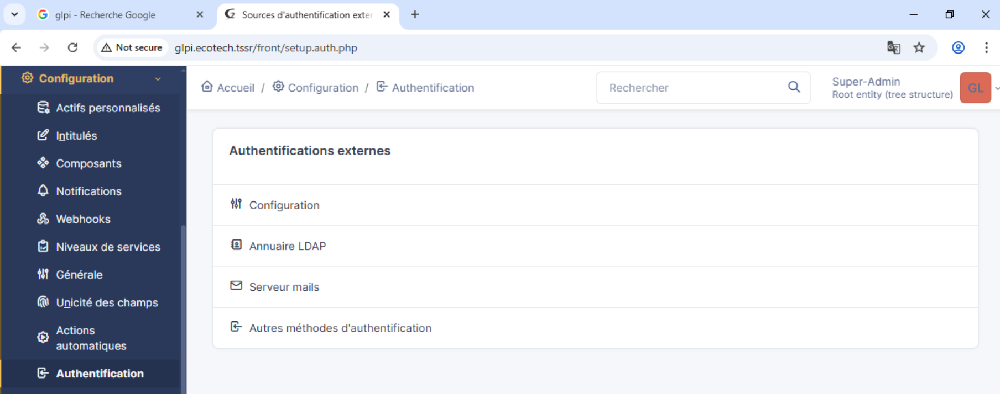
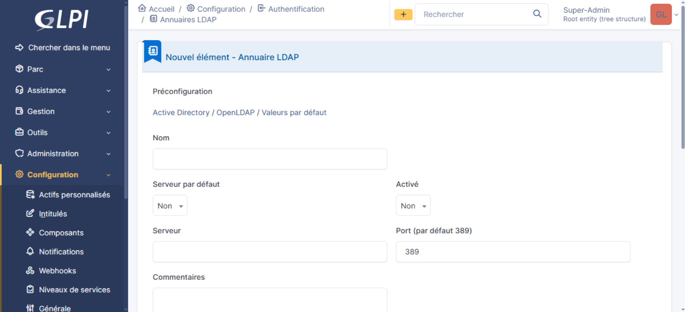
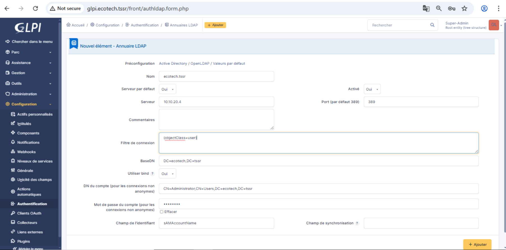
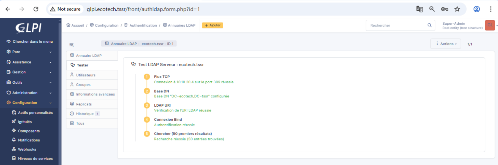
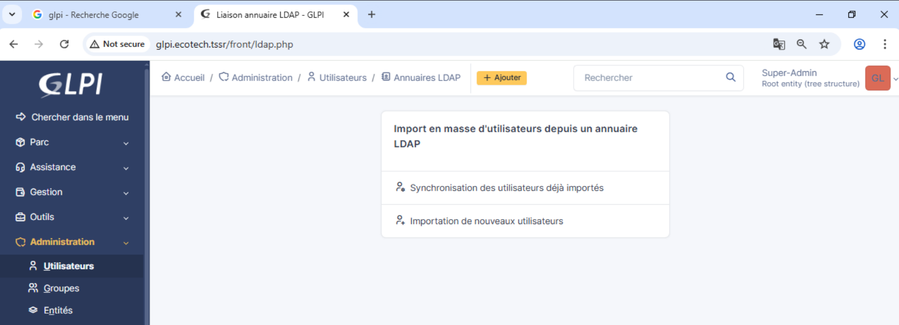

Connexion en gui avec l'adresse glpi.ecotech.tssr


Imports des utilisateurs et jonction avec la base ADDS

installer les utilitaires ldap

```
sudo apt install ldap-utils -y
```

commande pour trouver un user dans la base ldap ici ke.yamamoto 
pour tester l'annuaire ldap
```
ldapsearch -x -H ldap://10.10.20.4 -D "CN=Administrator,CN=Users,DC=ecotech,DC=tssr" -w "Azerty1*" -b "DC=ecotech,DC=tssr" "(sAMAccountName=ke.yamamoto)"
```
ca fonctionne de mon coté

voyons maintenant comment lie la base ldap a glpi 
