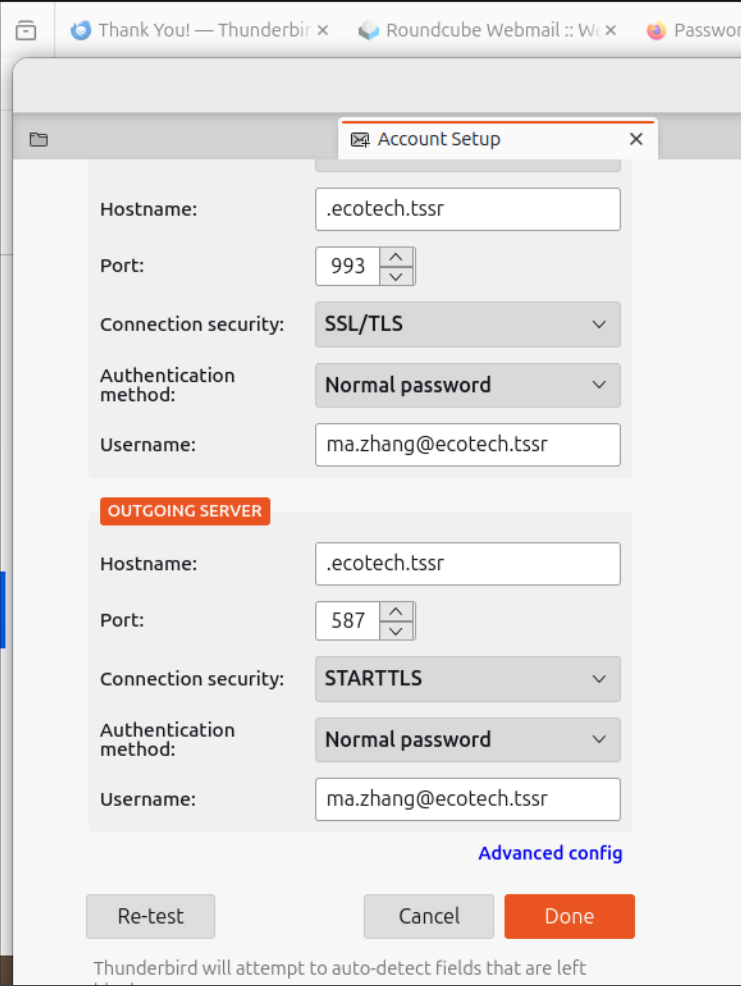
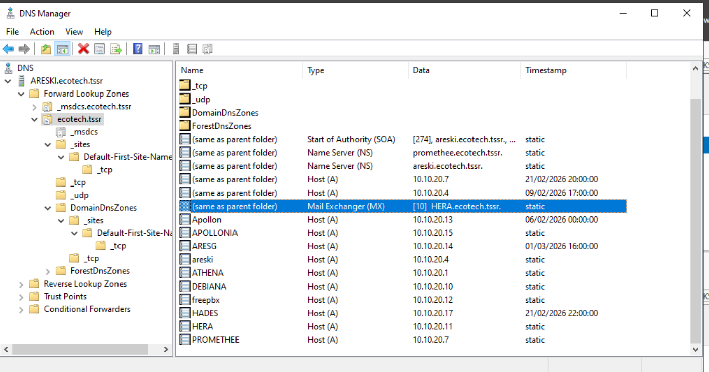
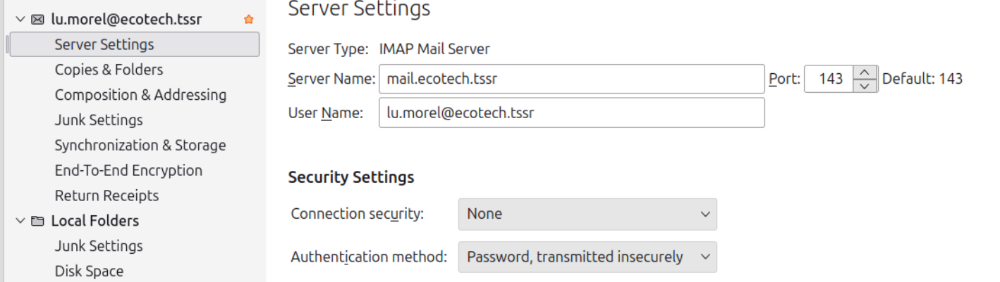
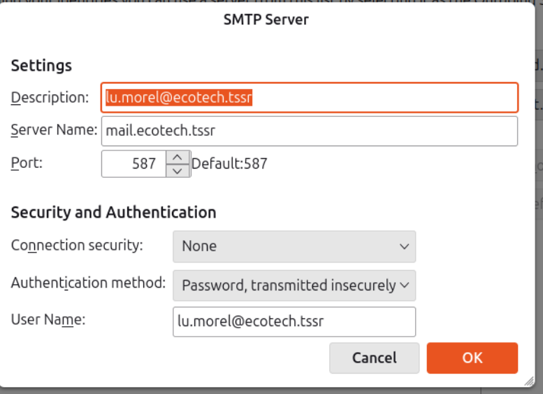
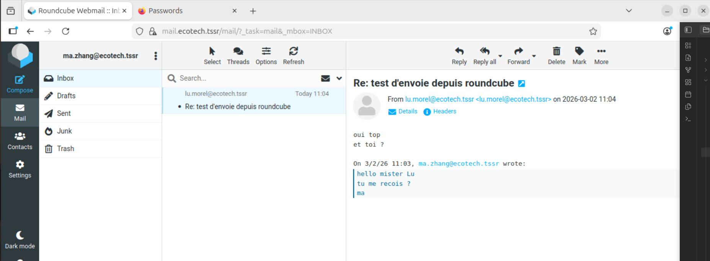
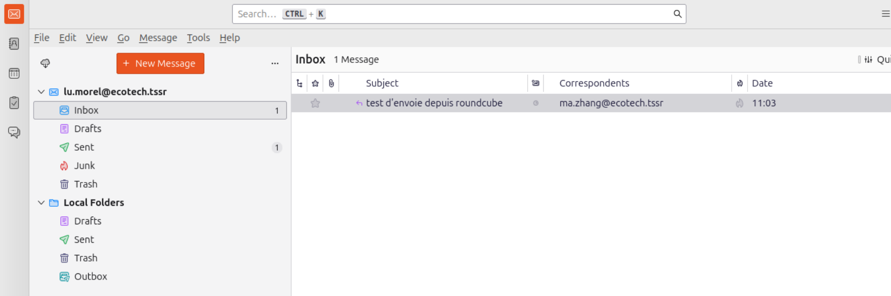
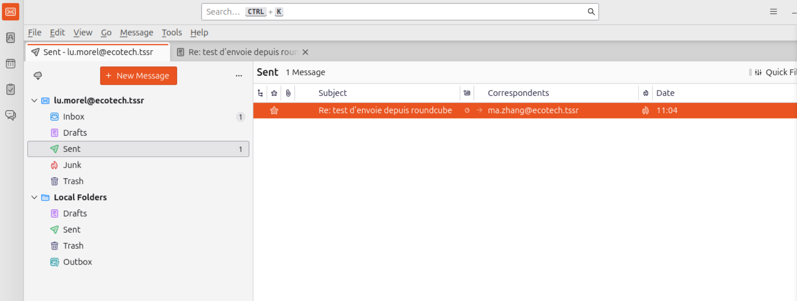

La config d'un serveur mail est intrinsèquement complexe
 Postfix + Dovecot + TLS + LDAP + Thunderbird = beaucoup de couches qui doivent s'aligner. 
 Un seul paramètre mal placé bloque tout et les messages d'erreur ne sont pas toujours clairs.
 

si tout est fonctionnel avec round cube , c'est une etape de franchit , maintenant il faut passer a travers le réseau et pour cela installer un  client de messagerie .
voici la démarche pour installer thunderbird avant tout:

```

wilder@APOLLONIA:~$ sudo apt install thunderbird

puis on lance l'application :

wilder@APOLLONIA:~$ thunderbird

```


```
  
* POP3 service: port 110 over STARTTLS (recommended), or port 995 with SSL.  
* IMAP service: port 143 over STARTTLS (recommended), or port 993 with SSL.  
* SMTP service: port 587 over STARTTLS.  
  If you need to support old mail clients with SMTP over SSL (port 465),  
  please check our tutorial: [https://docs.iredmail.org/enable.smtps.html](https://docs.iredmail.org/enable.smtps.html)  
* CalDAV and CardDAV server addresses: https://<server>/SOGo/dav/<full email address>  
  
For more details, please check detailed documentations:  
[https://docs.iredmail.org/#mua](https://docs.iredmail.org/#mua)
```
on arrive sur la création du compte 


suivez les demandes
configurez manuellement.
preferez le port 993  pour IMAP securisé en serveur d'envoi
preferez le port 587 pour starttls sur  SMTP





on verifie avec nslookup que le le dns delivre bien le sercice mail sur la bonne adresse IP , ici la vm HERA  sur 10.10.20.11

```
wilder@APOLLONIA:~$ nslookup mail.ecotech.tssr
Server:		127.0.0.53
Address:	127.0.0.53#53

Non-authoritative answer:
Name:	mail.ecotech.tssr
Address: 10.10.20.11
```
Apres plusieurs tentative de configuration j'abandonne le coté securisé 
et je refait les réglages sans tls 





# résultat:

Envoie d'un msg a une personne de l'entreprise via roundcube




reception du msg de ma.zhang par lu.morel dans thunderbird 




réponse de lu.morel dans thunderbird vers roundcube to ma.zhang




réception du message de lu.morel dans roundcube par ma.zhang 


# réglages du tls  pour sécuriser les communications 