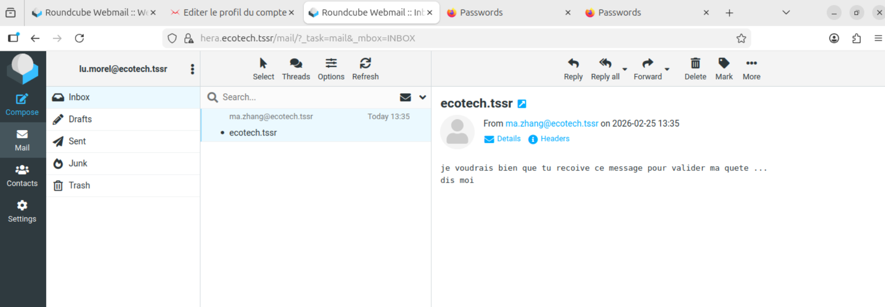
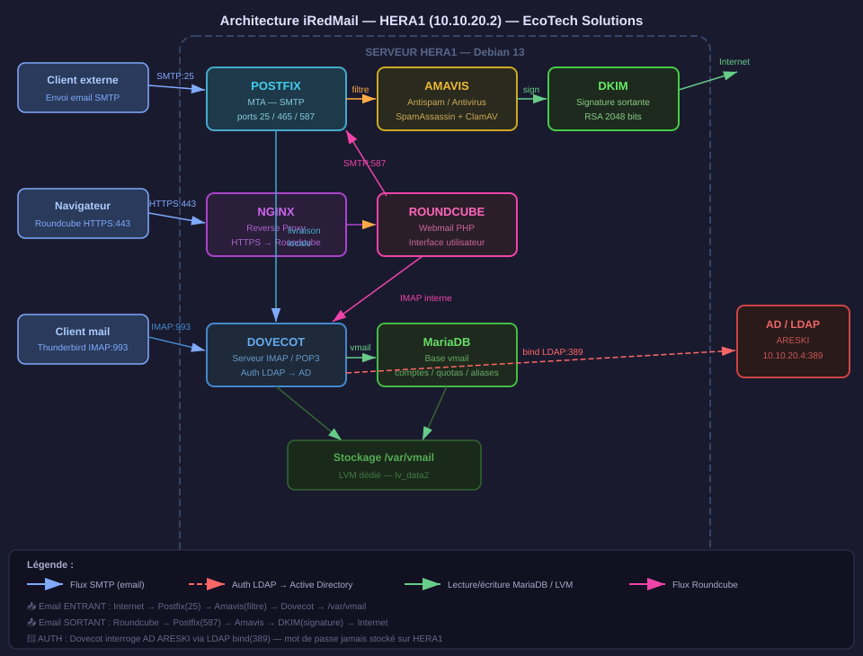

Installation de iredmail sur une debian 13 gui
commande faite depuis host en ssh sur port 34000 
Deux cartes reseau sur virtual box 
1 en nat avec redirection de port 
1 en reseau interen sur reseau ACROPOLE  avec ip fixe en 10.10.20.10

 on installera iredmail sur lv data 2 
 
 
 
# partition principal

```
sudo mkfs.ext4 /dev/vg_data/lv_data
```

UUID du nouveau `lv_data` : `2ea85851-a868-4c73-9e51-0b47d534b7f8`

 creation du dossier de montage et collage du uuid dans le fstab pour montage automatique
 onn garde la parttion lv data2 pour les logs et le stockage 
 
```bash
sudo mkdir -p /var/vmail && sudo mount /dev/vg_data/lv_data /var/vmail
```

# partition secondaire log et stockage

 
```
 sudo mkfs.ext4 /dev/vg_data/lv_data2
```

```
 sudo mkdir -p /log/var/iredmail && sudo mount /dev/vg_data/lv_data2 /log/var/iredmail 
```

relancer le systemd 

```
systemctl daemon-reload
```

```

==== AUTHENTICATING FOR org.freedesktop.systemd1.reload-daemon ====
Une authentification est requise pour recharger l'état de systemd.
Authenticating as: wilder,,, (wilder)
Password:
==== AUTHENTICATION COMPLETE ====
```


# Gestion du nom du serveur mailmaintenant  

on Écrit `hera.ecotech.tssr` dans `/etc/hostname`
 et on applique le changement immédiatement sans redémarrage


`hostnamectl set-hostname hera.ecotech.tssr` 

puis on verifie le nom dans /etc/hosts: 
on doit avoir "nom de la vm" .domaine de ADDs


# telechargement de iredmail :


```
wget https://github.com/iredmail/iRedMail/archive/refs/tags/1.7.4.tar.gz
```
```
on decompresse 
tar xvf 1.7.4.tar.gz 

on se place dans le dossier iredmail
cd iRedMail-1.7.4

on installe avec le scripte
sudo bash iRedMail.sh
```


Azerty1*2025


l'install se lance 
beaucoups de paquets 

# pour DEBIAN 13
corection a faire dans le scripte si certains paquets ont changé de nom entre la debian 12 et la debian 13 
### 1 autoriser debian 13
```
nano +289 conf/global  

Trouve la ligne :  
echo "{DISTRO_VERSION}" | grep -E '^(12)' &>/dev/null

Remplace par :
 echo "{DISTRO_VERSION}" | grep -E '^(12|13)' &>/dev/null
```
 
### 2 utilise sed pour trouver et remplacer les paquets modifié pour debian 13

nano +536 functions/packages.sh ``` 

Trouve la ligne : ```
ALL_PKGS="{ALL_PKGS} netcat" 
``` Remplace par : ``` 
ALL_PKGS="{ALL_PKGS} netcat-openbsd"  

Puis trouve : ``` 
ALL_PKGS="${ALL_PKGS} bzip2 acl patch cron tofrodos logwatch unzip bsdutils liblz4-tool rsyslog"
remplace `liblz4-tool` par `lz4` 


# Fin de l'install
```
grep: /etc/php//fpm/php.ini: No such file or directory
Can't open /etc/php//fpm/php.ini: No such file or directory.
[ INFO ] Configure mlmmj (mailing list manager).
[ INFO ] Configure ClamAV (anti-virus toolkit).
[ INFO ] Configure Amavisd-new (interface between MTA and content checkers).
chown: cannot access '/var/lib/dkim/ecotech.tssr.pem': No such file or directory
chmod: cannot access '/var/lib/dkim/ecotech.tssr.pem': No such file or directory
[ INFO ] Configure SpamAssassin (content-based spam filter).
[ INFO ] Configure iRedAPD (postfix policy daemon).
[ INFO ] Configure iRedAdmin (official web-based admin panel).
[ INFO ] Configure Roundcube webmail.
[ INFO ] Configure Fail2ban (authentication failure monitor).
[ INFO ] Configure netdata (system and application monitor).

*************************************************************************
* iRedMail-1.7.4 installation and configuration complete.
*************************************************************************

< Question > Would you like to use firewall rules provided by iRedMail?
< Question > File: /etc/nftables.conf, with SSHD ports: 22. [Y|n]< n >
[ INFO ] Skip firewall rules.
[ INFO ] Updating ClamAV database (freshclam), please wait ...
ERROR: Failed to lock the log file /var/log/clamav/freshclam.log: Resource temporarily unavailable
********************************************************************
* URLs of installed web applications:
*
* - Roundcube webmail: https://hera.ecotech.tssr/mail/
* - netdata (monitor): https://hera.ecotech.tssr/netdata/
*
* - Web admin panel (iRedAdmin): https://hera.ecotech.tssr/iredadmin/
*
* You can login to above links with below credential:
*
* - Username: postmaster@ecotech.tssr
* - Password: Azerty1*2025
*
********************************************************************
* Congratulations, mail server setup completed successfully. Please
* read below file for more information:
*
*   - /home/wilder/iRedMail-1.7.4/iRedMail.tips
*
* And it's sent to your mail account postmaster@ecotech.tssr.
*
********************* WARNING **************************************
*
* Please reboot your system to enable all mail services.
*
********************************************************************

```

Depuis le réseau ACROPOLE vers HERA :

|Port|Protocole|Service|Sens|
|---|---|---|---|
|25|TCP|SMTP (réception mail)|entrant|
|587|TCP|SMTP submission (envoi clients)|entrant|
|143|TCP|IMAP|entrant|
|993|TCP|IMAP SSL|entrant|
|443|TCP|HTTPS (Roundcube/iRedAdmin)|entrant|
|80|TCP|HTTP (redirection vers 443)|entrant|


Quick MUA Settings

- Login username of SMTP/POP3/IMAP services must be full email address.
- POP3 service: port 110 over STARTTLS, or port 995 with SSL.
- IMAP service: port 143 over STARTTLS, or port 993 with SSL.
- SMTP service: port 587 over STARTTLS, or port 465 with SSL.
- CalDAV and CardDAV server addresses: `https://<server>/SOGo/dav/<full email address>`

Pour l'instant en lab interne, les clients mail (Thunderbird) et HERA sont sur le même réseau ACROPOLE — le trafic ne passe pas par pfSense. Ces règles seront utiles surtout quand tu ouvriras l'accès depuis les VLANs HERCULE.**En interne (VLANs HERCULE → HERA) :** Les utilisateurs des différents départements (RH, Finance, DSI...) accèdent à leur messagerie via Roundcube (443) ou Thunderbird (IMAP 993, SMTP 587).

**Depuis le WAN (ZEUS ou accès externe) :** Un utilisateur en dehors du réseau peut relever ses mails via Thunderbird en IMAP/SMTP chiffré (993/587) — à condition d'ouvrir ces ports en NAT sur pfSense vers HERA.

---

**Sécurité importante :**

- Ports 993 et 587 → toujours chiffrés SSL/TLS ✅
- Port 25 → uniquement entre serveurs mail (MTA to MTA), ne jamais l'ouvrir au WAN pour les clients
- Port 80 → redirige automatiquement vers 443, pas besoin de l'ouvrir depuis le WAN
  
  
  redemarrage et verif des services 
  
  

---
# APARTE SUR LE PROBLEME D'INCOMPATIBILIITE DE DEBIAN 13 ET DOVECOT
**Les commandes clés à retenir pour l'exam :**

bash

```bash
systemctl status service        # vue rapide
journalctl -xeu service         # logs détaillés systemd
/usr/sbin/dovecot -F 2>&1       # lancer le binaire directement
grep -rn "mot" fichier          # chercher dans les configs
sed -i 's/ancien/nouveau/' fichier  # modifier en place
```

**Le raisonnement à verbaliser à l'oral :**

> "J'ai isolé le service en erreur, j'ai contourné systemd pour obtenir le message brut, j'ai identifié un pattern de corrections en cascade qui m'a orienté vers un problème structurel de compatibilité de versions, puis j'ai consulté la documentation officielle."

C'est exactement le type de démarche attendu d'un technicien senior.

## Raisonnement et démarche de diagnostic

### 1. Identification du problème racine

iRedMail génère ses fichiers de configuration pour **Dovecot 2.3**. Debian 13 (Trixie) installe **Dovecot 2.4** qui a cassé la compatibilité ascendante — ce n'est pas une mise à jour mineure, c'est une réécriture de la syntaxe de configuration.

On a forcé iRedMail à accepter Debian 13 en modifiant `conf/global`, mais iRedMail ne peut pas générer des configs Dovecot 2.4 correctes car il ne les connaît pas.

---

### 2. Méthode de diagnostic appliquée

**Étape 1 — Lire le message d'erreur systemd**

```
Fatal: Error in configuration file dovecot.conf line 7
```

→ Le service ne démarre pas à cause d'un fichier de config invalide.

**Étape 2 — Contourner systemd pour voir l'erreur brute**

bash

```bash
sudo dovecot -F 2>&1
```

Lancer le binaire directement sans passer par systemd donne des messages d'erreur plus précis et ligne par ligne.

**Étape 3 — Identifier le pattern** Chaque fois qu'on corrigeait un paramètre, une nouvelle erreur apparaissait sur la ligne suivante. Ce pattern de corrections en cascade indique un problème structurel, pas un bug isolé.

**Étape 4 — Rechercher la solution officielle** Plutôt que de corriger paramètre par paramètre indéfiniment, on a cherché si l'éditeur iRedMail avait documenté ce problème. La recherche a confirmé que c'est un problème connu et documenté, avec un fichier de config Dovecot 2.4 fourni officiellement.

**Étape 5 — Remplacer la config entière** Plutôt que patcher, on a remplacé `/etc/dovecot/dovecot.conf` par le fichier officiel adapté à Dovecot 2.4 + MariaDB, puis on a juste substitué le mot de passe `vmailadmin`.

---

### Leçon clé

Quand une correction génère une nouvelle erreur en cascade → c'est le signal qu'il faut chercher une solution globale, pas continuer à corriger ligne par ligne. Chercher la documentation officielle avant de bricoler fait gagner beaucoup de temps.


# REPRISE

Maintenant on teste l'accès webmail depuis APOLLONIA  sur le réseau ACROPOLE :

```
https://hera.ecotech.tssr/mail/
```

Login : `postmaster@ecotech.tssr`  
Password : `Azerty1*2025`


---

Dans ADDS

creation d'une OU de compte de services "services accounts"
creation d'un user "compte de service AD" svc.iredmail


si probleme pour relier le LDAP : 

```
sudo apt install dovecot-ldap
sudo apt install ldap-utils -y


```





maintenant création des boites mails pour tout le monde et good...


