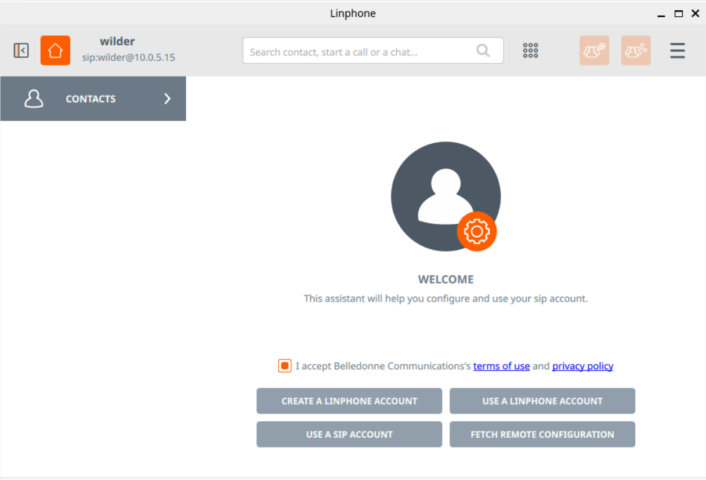
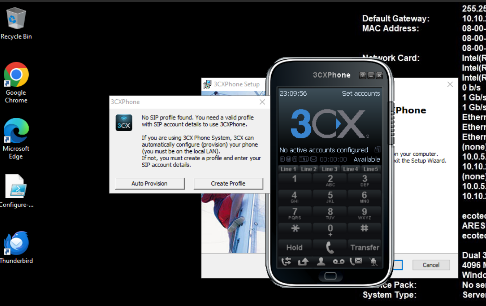

## pour ubuntu

```
sudo apt install linphone-desktop
```

## pour windows

```
https://3cxphone.software.informer.com/download/#downloading
```




clique sur set accounts et une fentre de compte s'ouvre


## 1) Config du poste de Mateo zhang

