si vous perdez la main pdt la config essaye en CLI , il se peut que le firewall se soit activé

```
fwconsole firewall stop
```

**Abort le firewall** et nous arrivons sur le panneau de config

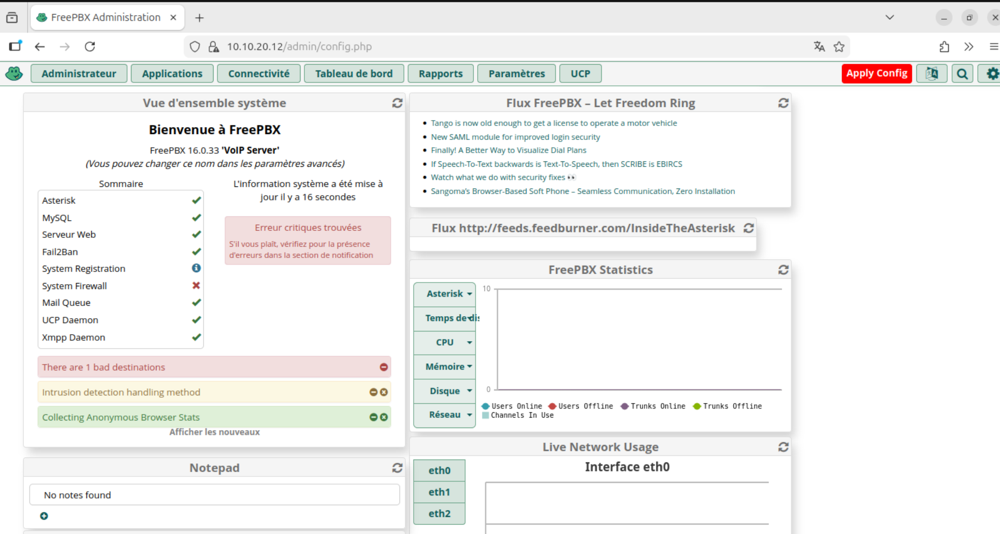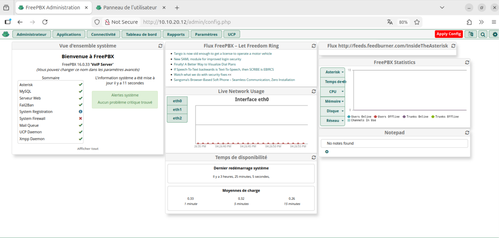


dans Admin/system Admin on peut activer freepbx pour récuperer **le trial de 15 jours** 


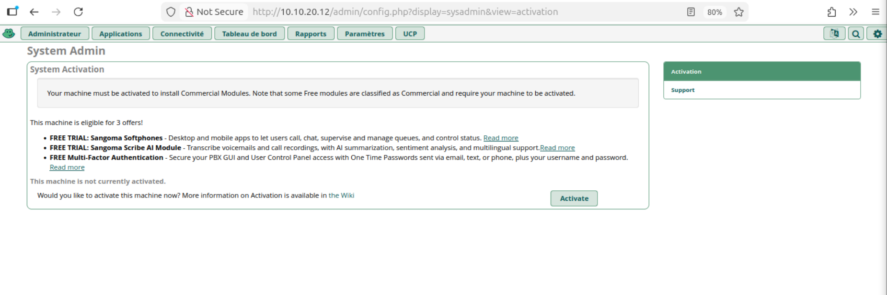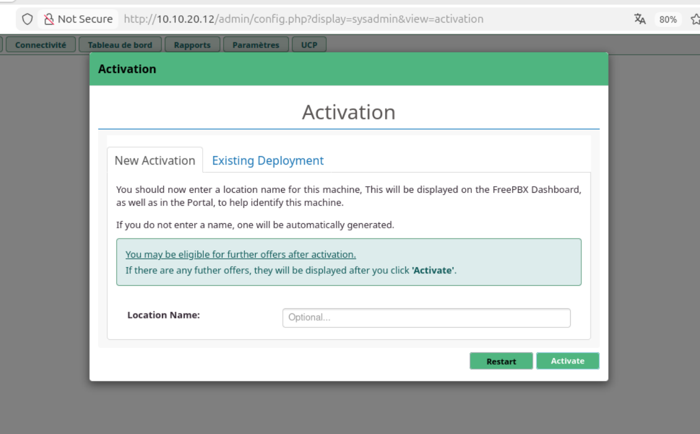


maintenant faisons **la mise a jour :**


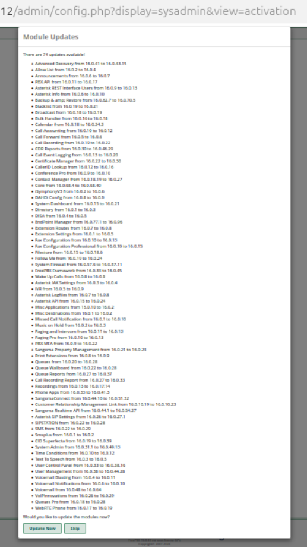

et encore quelque mise a jour

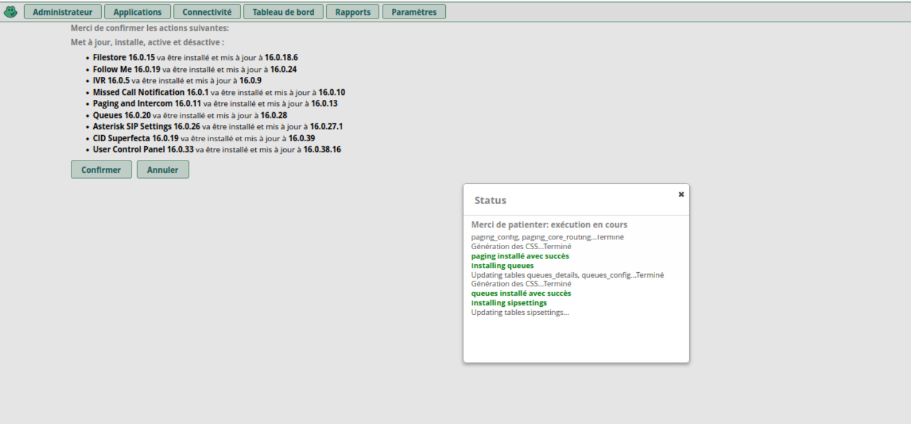

maintenant ajoutons des **postes SIP** 
rendez vous dans **Applications /postes**

.png)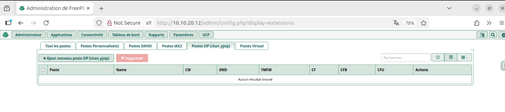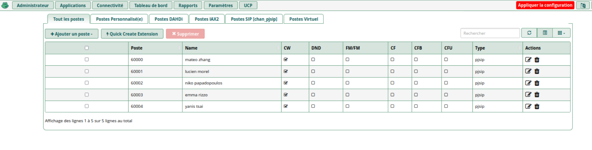


Apres avoir installer les terminaux sip dans vos vm, lancer un appel .
## A vous de parler 
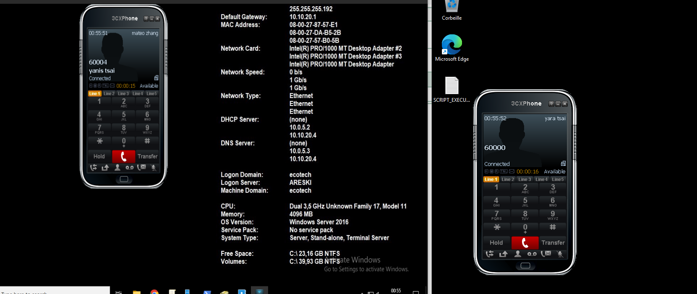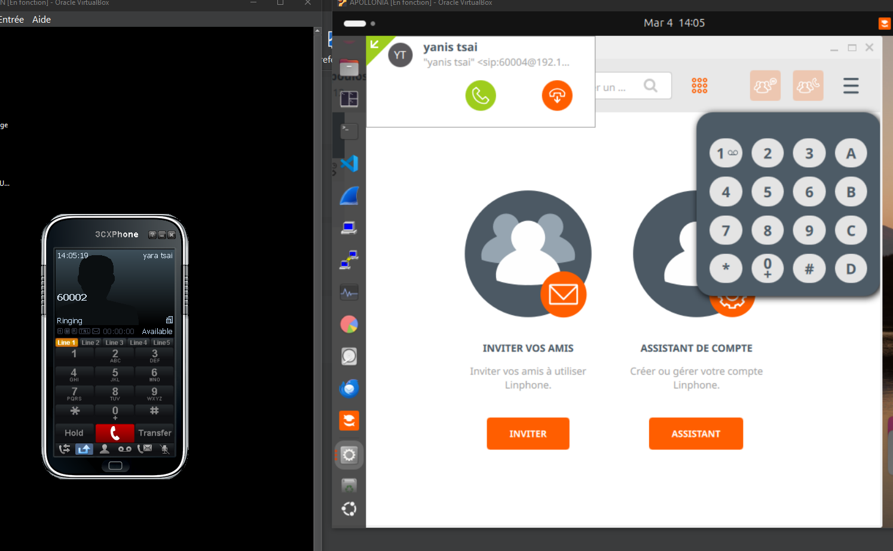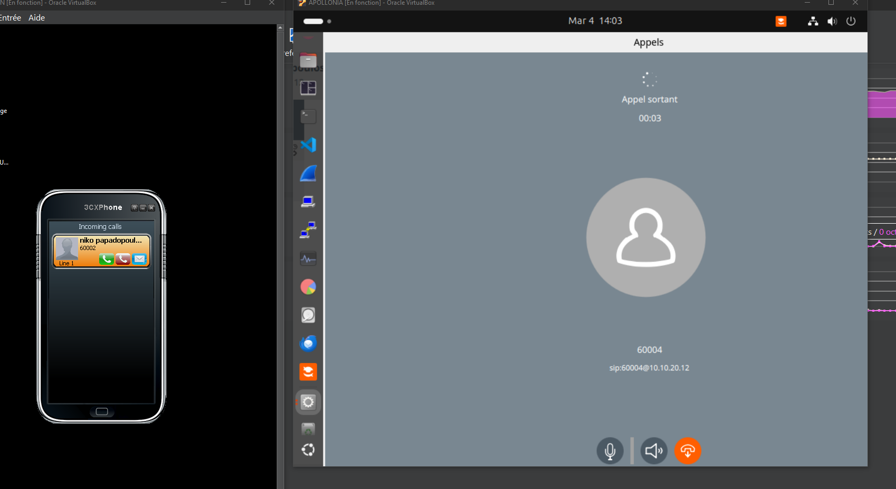


# Renvoi d'appel

dans Aplications / Suivez moi 
Active le poste que vous voulez renvoyer .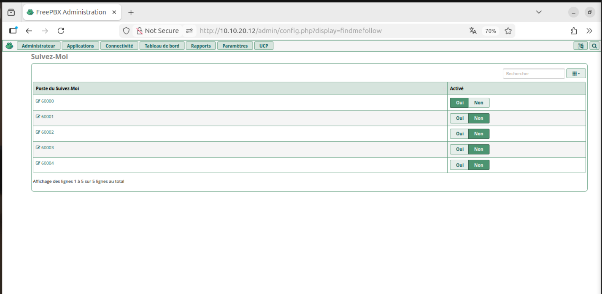

pour le initial ring time 
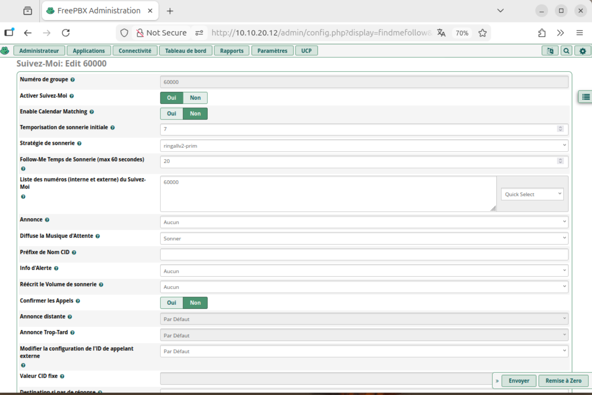

a la fin n'oubliez pas de cliquer sur "envoyer" sinons vos réglages ne seront pas pris en compte .