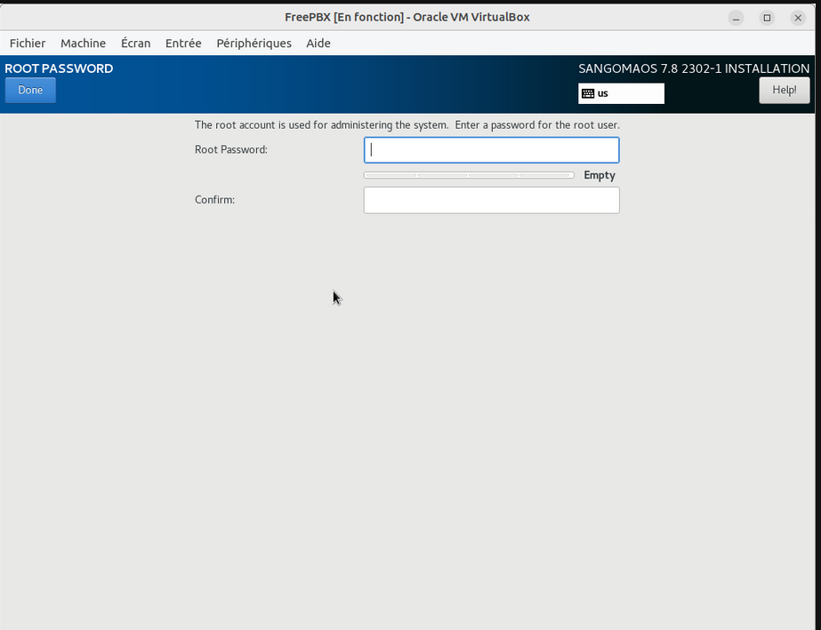
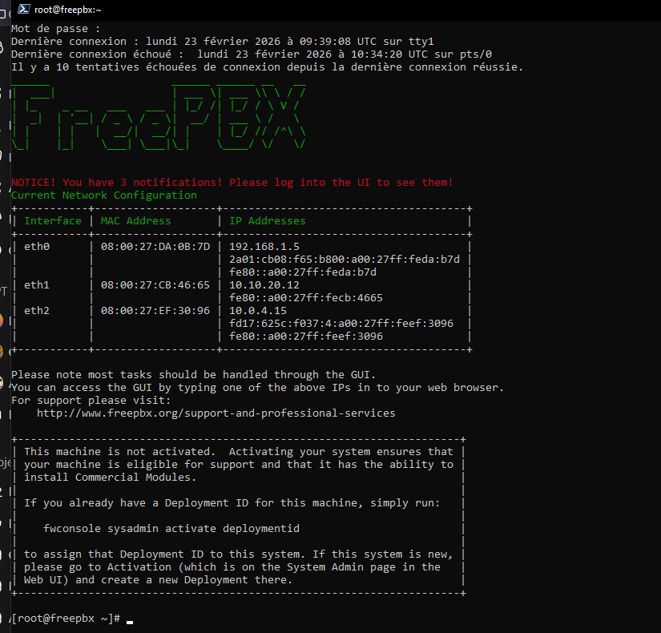

## Installation

Au démarrage de la VM, dans la liste, choisir la version **recommandée**. 


Puis sélectionner `Graphical Installation - Output to VGA`.  


Enfin choisir `FreePBX Standard`  


Pendant l'installation, il faut configurer le mot de passe root (`Root password is not set` s'affiche).  



Clique sur `ROOT PASSWORD` et entre un mot de passe (robuste, est-il besoin de le préciser ?) pour le compte root.

Le clavier est en anglais donc attention aux lettres des touches du clavier QWERTY !


Indication que le mot de passe root a été changé :  


L'installation continue et se termine.  


Éteindre la VM, enlever l'ISO du lecteur et redémarrer la VM.  

Connecte toi en root.

### [](https://odyssey.wildcodeschool.com/quests/2790/pages/10087#modification-de-la-langue-du-clavier)Modification de la langue du clavier

La commande `localectl` donne les informations suivantes :

```
System Locale: LANG=en_US.UTF-8
    VC Keymap: us
   X11 Layout: us
```

Vérifie avec la commande `localectl list-locales` que tu as bien `fr_FR.utf8` dans la liste qui s'affiche.

Ecrit les lignes de commandes suivantes pour mettre le clavier en français :

```
localectl set-locale LANG=fr_FR.utf8
localectl set-keymap fr
localectl set-x11-keymap fr
```

Vérifie avec la commande `localectl` :

```
System Locale: LANG=fr_FR.UTF-8
    VC Keymap: fr
   X11 Layout: fr
``````

````
``



si vous etes en user standart et que au demarrage , les interfaces reseaux sont eteintes alors passez en root pour allumer les interfaces avec 

```
ifup eth<nbre>
verifier le up avec ip a 
```


on se connecte sur son adresse ip 
ici 10.10.20.12. et on arrive sur l'interface graphique 
on passe sur user Guide .
merci


