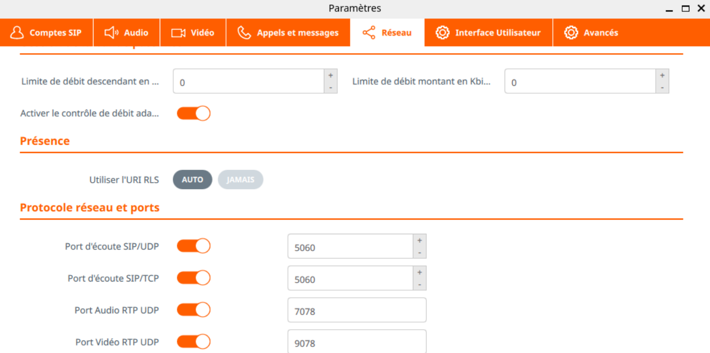
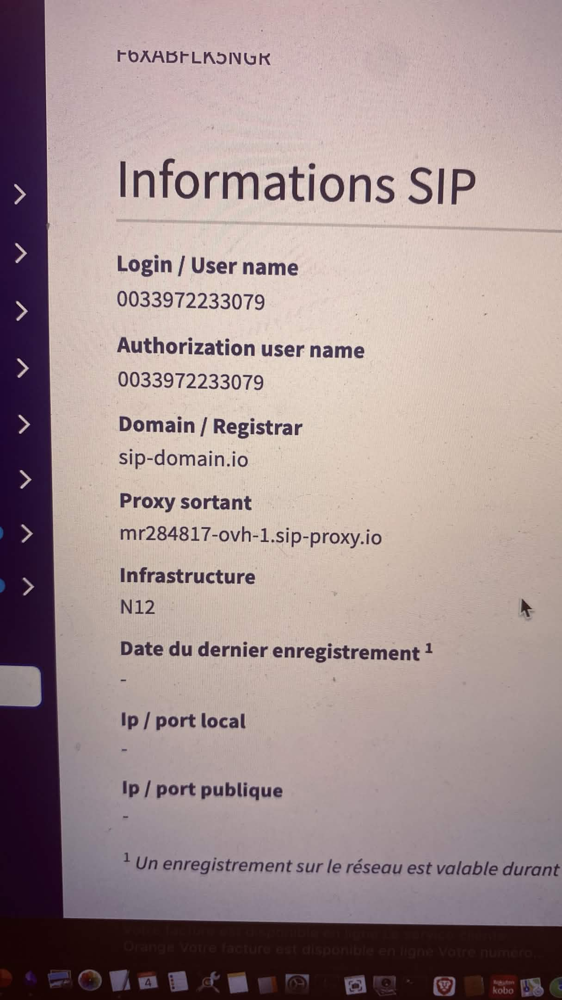
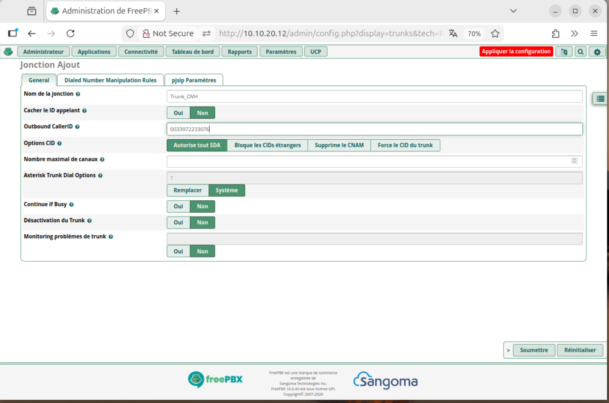
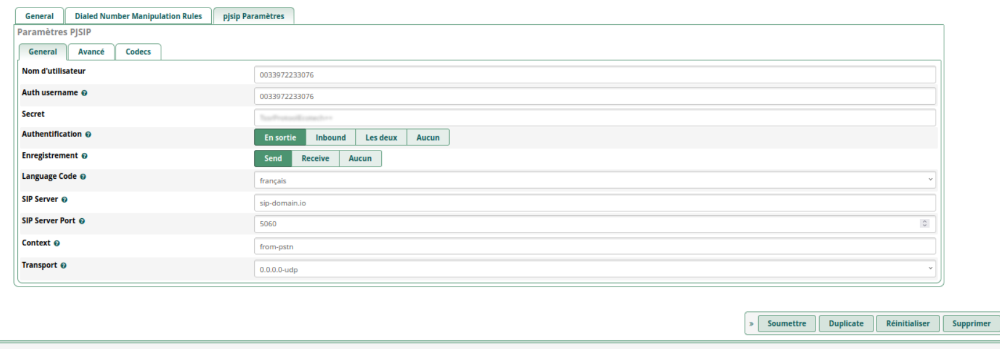
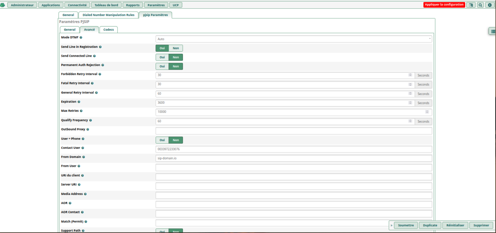
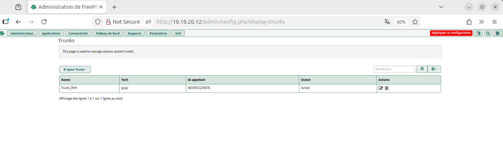
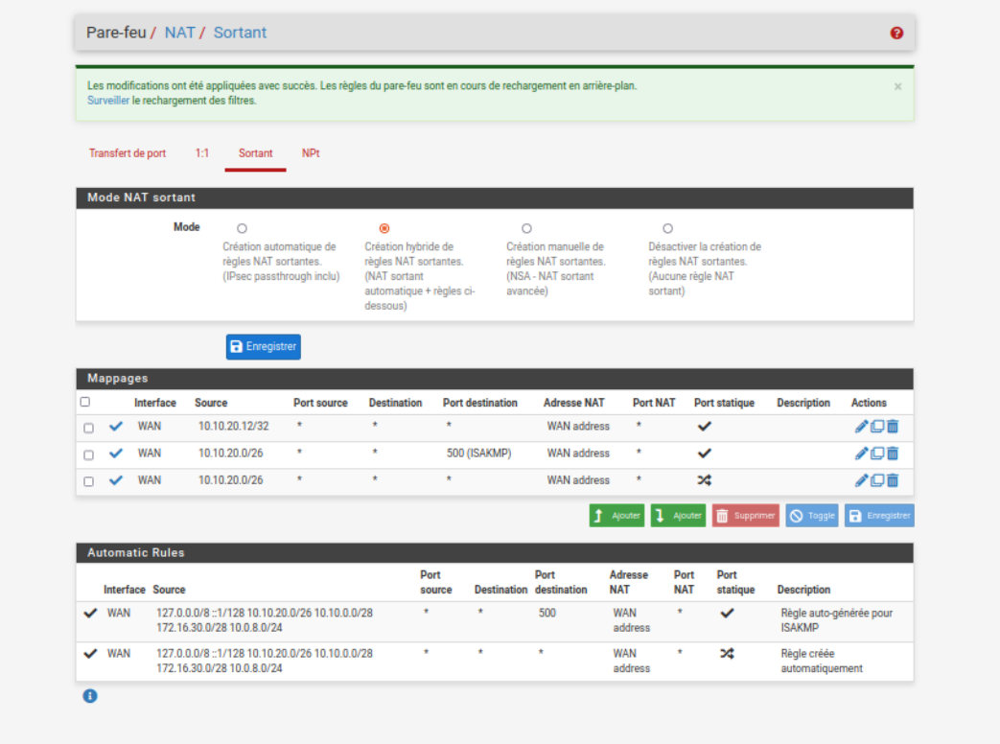
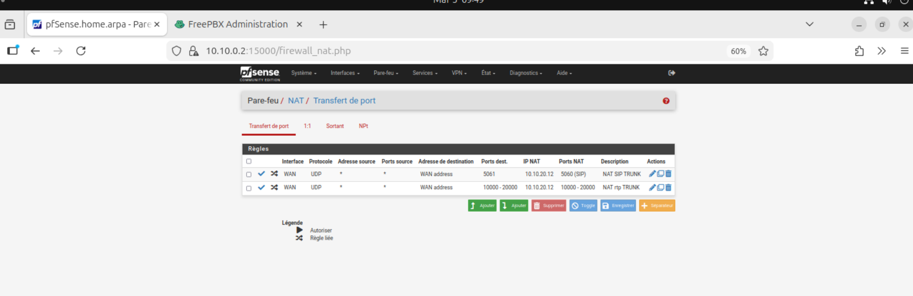

Pour infos reglages des port sip 

# lien vers un compte sip ovh

clique sur connectivite / trunk 

### remplir les infos

### Onglet mode Avancée remplir Contact user puis Domain 

###  Soumettre   

### Appliquer la configuration en rouge en haut a droite 

## reglages de la redirection de port sur la box 

comme il y a conflit dans la box sur le port 4060 on passe sur 4061 donc il faut faire la modif sur asterix port listening

allez faire le reglages  dans parametre / parametre SIP d'asterix / port to listen on
